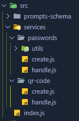
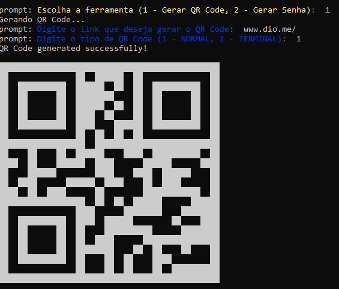
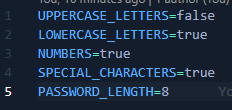
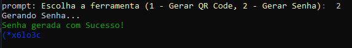

# Projeto em NodeJS para criação de senhas e gerar QR Code através do Terminal.

## Possui uma estrutura básica focada no desenvolvimento de cada serviço.

;

## Exemplo de QR Code gerado com a ferramenta:

## A ferramenta de geração de passwords possui um arquivo .env para determinar os parâmetros da senha.

## Exemplo de senha gerada com os parâmetros acima.

